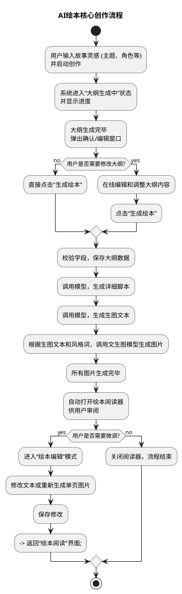
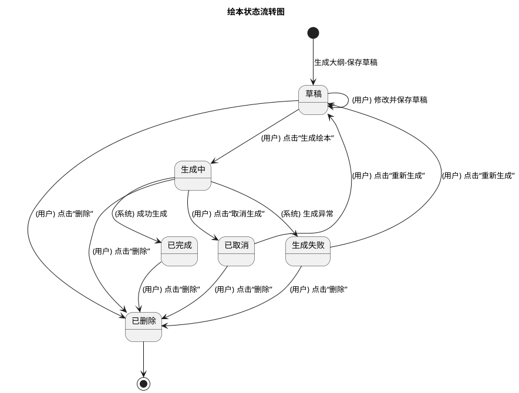

# AI 绘本功能需求文档

## 1. 修订历史

| 版本号 | 修订日期 | 修订人 | 修订内容 |
| :--- | :--- | :--- | :--- |
| V1.0 | 2025-10-16 | Gemini | 创建文档 |

## 2. 项目概述

AI 绘本功能是XX教育软件中的一个创新模块，旨在通过人工智能技术，帮助用户将简单的故事构想转化为图文并茂的电子绘本。用户只需输入核心创意，系统便能辅助生成故事大纲、角色、场景，并最终生成完整的绘本内容。

本项目原型主要涵盖两大核心流程：**新绘本的创作流程** 和 **已有绘本的管理流程**。

## 3. 全局流程

### 3.1. 名词解释
- **草稿**：用户已生成故事大纲，但尚未开始生成绘本。草稿可以被再次编辑。
- **生成中**：系统正在根据大纲生成绘本的插画和文本。此过程不可逆，但可以取消。
- **已完成**：绘本已成功生成，可以进行阅读和编辑。
- **生成失败**：系统在生成过程中遇到错误导致中断。用户可以返回大纲页重新生成。
- **已取消**：用户主动中断了“生成中”的绘本。用户可以返回大纲页重新生成。

### 3.2. 核心用户流程图

此图从用户视角描绘了创作一本新绘本的核心业务流程。



## 4. 功能详述

为了清晰地管理和追踪所有功能点，我们将其分为以下几个主要类别。

### 4.1. 绘本首页

绘本首页是应用的入口和核心功能区，用户在此输入灵感、启动创作流程，并能浏览精选作品。

#### 4.1.1. 故事灵感输入

-   **UI组件**: 一个多行文本输入框 (`<textarea>`)。
-   **占位提示**: "输入您想创作的绘本故事（如：一只寻找星星的勇敢小狐狸）。"
-   **校验规则**:
    -   **必填**: 是。若为空，提示“请输入故事内容”。
    -   **最小长度**: 5个字符。若不满足，提示“至少需要5个字符”。
    -   **最大长度**: 2000个字符（前端限制）。
    -   **内容要求**: 必须包含有效的字符（中文、英文或数字）。若不满足，提示“必须包含文字或数字”。
-   **交互**:
    -   输入内容不符合校验规则时，输入框边框变色并伴有轻微抖动动画，同时在下方显示相应的错误提示。

#### 4.1.2. 生成大纲流程

1.  **触发**: 用户点击“生成大纲”按钮。
2.  **前置条件**: “故事灵感输入”框的内容通过校验。
3.  **过程**:
    -   弹出一个模态窗口，实时展示“大纲生成进度”。
    -   进度分为四个固定阶段，各阶段状态依次流转，前一阶段完成后自动触发下一阶段开始。流程如下：
    ```plantuml
    @startuml

    state "阶段一：分析故事主题" as S1 {
      left to right direction
      state "等待中" as W1
      state "进行中" as R1
      state "已完成" as D1
      [*] --> W1
      W1 --> R1 : 开始
      R1 --> D1 : 3秒后
    }


    state "阶段二：生成角色设定" as S2 {
      left to right direction
      state "等待中" as W2
      state "进行中" as R2
      state "已完成" as D2
      W2 --> R2
      R2 --> D2 : 角色数据接收完毕
    }


    state "阶段三：生成场景设定" as S3 {
      left to right direction
      state "等待中" as W3
      state "进行中" as R3
      state "已完成" as D3
      W3 --> R3
      R3 --> D3 : 场景数据接收完毕
    }


    state "阶段四：生成故事大纲" as S4 {
      left to right direction
      state "等待中" as W4
      state "进行中" as R4
      state "已完成" as D4
      W4 --> R4
      R4 --> D4 : 大纲数据接收完毕
    }

    D1 --> R2 : 触发
    D2 --> R3 : 触发
    D3 --> R4 : 触发
    D4 --> [*] : 流程结束
    @enduml
    ```
4.  **结果**:
    -   “大纲生成进度”窗口自动关闭。
    -   自动打开“确认故事大纲”模态窗口，并将已生成的完整大纲内容回显其中，供用户审阅或编辑。

5.  **异常处理**:
    -   **异常情况**:
        -   **后端服务无响应或网络错误**: 客户端无法连接到生成大纲的后端服务（如网络断开、DNS 解析失败、后端服务宕机）。
        -   **生成内容失败**: 后端服务在内部处理生成大纲时发生错误（如 AI 模型生成失败、内部逻辑错误、数据处理异常），并返回明确的错误信息。
        -   **用户请求超时**: 大纲生成过程耗时过长（超过 100 秒），导致前端未在规定时间内收到响应。这通常意味着后端处理出现问题。
        -   **接口返回数据格式错误**: 后端接口返回的数据不是预期的格式或缺少必要的字段，导致前端无法正确解析。
    -   **处理方案**:
        -   当上述任何一种异常情况发生时，立即关闭当前显示生成进度的模态窗口。
        -   在页面上方示一个简短的 Toast 通知，告知用户具体的错误信息。Toast 提示应短暂显示（例如 3-5 秒后自动消失），并带有醒目的颜色以表示错误状态。
        -   **提示信息**:
            -   "网络连接失败，请检查您的网络设置。"
            -   "大纲生成失败，请稍后再试或联系管理员。"
            -   "请求超时，生成大纲时间过长，请稍后再试。"
            -   "服务器返回数据异常，请联系技术支持。"

#### 4.1.3. 精选绘本展示

-   **功能**: 在页面下方，以卡片形式展示一系列高质量的绘本封面和标题。
-   **数据来源**: 由后端提供一个接口，返回被标记为“精选”的绘本列表。
-   **内容**: 绘本创建功能上线后，产品团队将使用该功能创建10本绘本，并由后端在数据库中标记为“精选”，作为初始展示内容。
-   **交互**: 点击任意一本精选绘本，可以进入该绘本的阅读模式。

### 4.2. 确认故事大纲界面

“确认故事大纲”界面是用户在 AI 生成大纲后进行审阅、修改和个性化设置的核心环节，也是触发最终绘本生成前的最后一步。

#### 4.2.1. 进入方式

-   **首页生成大纲后**: 在绘本首页 (`index.html`) 点击“生成大纲”，并在AI模型成功生成大纲并返回数据后，系统自动打开此界面。
-   **我的绘本页 - 编辑草稿**: 用户在“我的绘本”页 (`my-books.html`) 中点击状态为“草稿”的绘本卡片时，进入此界面。
-   **我的绘本页 - 重新生成失败绘本**: 用户在“我的绘本”页 (`my-books.html`) 中点击状态为“生成失败”的绘本卡片时，进入此界面。

#### 4.2.2. 页面布局与内容

界面分为左右两部分，所有内容均可编辑。

-   **故事标题**:
    -   **UI组件**: 单行文本输入框 (`<input type="text">`)。
    -   **占位提示**: “请输入标题...”
    -   **校验规则**:
        -   **必填**: 是。若为空，提示“请输入故事标题”。
        -   **最大长度**: 50个字符（前端限制）。
    -   **校验时机与交互**: 在点击“生成绘本”按钮时进行校验。若不符合规则，输入框下方显示相应的错误提示。
-   **主要角色**:
    -   **UI组件**: 列表形式展示，每个角色包含：
        -   **角色名**: 单行文本输入框 (`<input type="text">`)。
        -   **角色描述**: 多行文本输入框 (`<textarea>`)。
    -   **占位提示**:
        -   角色名: “请输入角色名”
        -   角色描述: “请输入角色描述”
    -   **校验规则**:
        -   **必填**: 是。角色名和角色描述均不能为空。若为空，提示“请输入角色名”或“请输入角色描述”。
        -   **最大长度**: 角色名最多50个字符，角色描述最多500个字符（前端限制）。
    -   **校验时机与交互**:
        -   支持动态增加和删除角色。
        -   新增角色时，新增区域有短暂高亮效果。
        -   **校验时机**: 在点击“生成绘本”按钮时进行校验。若不符合规则，卡片方显示相应的错误提示。
        -   **约束**: 至少保留一个角色。若尝试删除最后一个角色，提示“至少需要保留一个主要角色！”。
-   **主要场景**:
    -   **UI组件**: 列表形式展示，每个场景包含：
        -   **场景名**: 单行文本输入框 (`<input type="text">`)。
        -   **场景描述**: 多行文本输入框 (`<textarea>`)。
    -   **占位提示**:
        -   场景名: “请输入场景名”
        -   场景描述: “请输入场景描述”
    -   **校验规则**:
        -   **必填**: 是。场景名和场景描述均不能为空。若为空，提示“请输入场景名”或“请输入场景描述”。
        -   **最大长度**: 场景名最多50个字符，场景描述最多500个字符（前端限制）。
    -   **校验时机与交互**:
        -   支持动态增加和删除场景。
        -   新增场景时，新增区域有短暂高亮效果。
        -   **校验时机**: 在点击“生成绘本”按钮时进行校验。若不符合规则，卡片方显示相应的错误提示。
        -   **约束**: 至少保留一个场景。若尝试删除最后一个场景，提示“至少需要保留一个主要场景！”。
        -   **联动**: 当场景被删除时，右侧故事大纲中所有关联到该场景的页面，其场景选择需自动清空。
-   **绘本风格选择**:
    -   **UI组件**: 卡片组，展示风格名称和图示。
    -   **数据来源**: 由后端数据库提供风格列表（含风格名称、风格描述、风格图示），不可在前端硬编码。
    -   **默认值**: “儿童插画风”。
    -   **交互**: 用户可点击选择不同的风格。
    -   **后端支持**: 需数据库增加风格表，包含 `style_name`, `style_description`, `style_image_url` 等字段。未来可考虑在管理平台实现风格管理功能。
-   **故事大纲列表**:
    -   **UI组件**: 以分页卡片形式展示故事大纲，每一页包含：
        -   **对应场景**: 下拉选择框 (`<select>`)，选项数据源于左侧“主要场景”列表。
        -   **情节描述**: 多行文本输入框 (`<textarea>`)。
    -   **占位提示**:
        -   对应场景: “选择场景...”
        -   情节描述: “请输入情节内容...”
    -   **校验规则**:
        -   **对应场景**: 必选。若未选择，提示“请选择场景”。
        -   **情节描述**: 必填。若为空，提示“请输入情节内容”。
        -   **最大长度**: 情节最多500个字符（前端限制）。
    -   **校验时机与交互**: 在点击“生成绘本”按钮时进行校验。若不符合规则，卡片下方显示相应的错误提示。
    -   **页数约束**: 大纲页数限制在 6 到 20 页之间。
        -   支持在任意页的上方或下方点击“在此处插入新页”按钮新增页面。当大纲页数达到20页时，添加按钮将被禁用，并显示“已达最大页数(20页)”提示。新增页有短暂高亮效果。
        -   支持点击“删除页”按钮删除页面。当大纲页数少于或等于6页时，删除按钮将被禁用。
        -   **交互**: 添加或删除页面时，页数将实时更新。
-   **页数显示**: 实时显示当前大纲的“共 X 页”。

#### 4.2.3. 顶部操作与交互

-   **“取消”按钮**: 当从“首页”进入此界面时显示。
    -   **交互**: 点击后弹出二次确认弹窗。若用户确认取消，则不保存当前编辑内容到“我的绘本”中，并关闭此界面。
-   **“关闭”按钮**: 当从“我的绘本”页进入此界面时显示。
    -   **交互**: 点击后直接关闭此界面，不进行保存。
-   **“保存草稿”按钮**:
    -   **交互**: 点击后保存当前所有修改。保存成功后，关闭此界面。
-   **“生成绘本”按钮**:
    -   **交互**: 点击后，系统将对所有字段进行严格校验。若校验通过，则保存当前大纲数据，关闭此界面，并启动绘本生成流程，同时打开一个实时的生成进度窗口。

### 4.3. 生成绘本进度界面

1.  **触发**: 用户在“确认故事大纲”页点击“生成绘本”按钮。
2.  **前置条件**: “确认故事大纲”页的所有字段均通过校验。
3.  **过程**:
    -   弹出一个模态窗口，实时展示“绘本生成进度”。
    -   进度分为四个固定阶段，各阶段状态依次流转，前一阶段完成后自动触发下一阶段开始。流程如下：
    ```plantuml
    @startuml
    state "阶段一：分析故事大纲" as S1 {
      left to right direction
      state "等待中" as W1
      state "进行中" as R1
      state "已完成" as D1
      [*] --> W1
      W1 --> R1 : 开始
      R1 --> D1 : 10秒后
    }

    state "阶段二：生成故事脚本" as S2 {
      left to right direction
      state "等待中" as W2
      state "进行中" as R2
      state "已完成" as D2
      W2 --> R2
      R2 --> D2 : 脚本数据接收完毕
    }

    state "阶段三：优化画面描述" as S3 {
      left to right direction
      state "等待中" as W3
      state "进行中" as R3
      state "已完成" as D3
      W3 --> R3
      R3 --> D3 : 画面描述接收完毕
    }

    state "阶段四：生成插图" as S4 {
      left to right direction
      state "等待中" as W4
      state "进行中" as R4
      state "已完成" as D4
      W4 --> R4
      R4 --> D4 : 所有插图生成完毕
    }

    D1 --> R2 : 触发
    D2 --> R3 : 触发
    D3 --> R4 : 触发
    D4 --> [*] : 流程结束
    @enduml
    ```
4.  **结果**:
    -   所有步骤完成后，“生成绘本进度”窗口将自动关闭。
    -   系统自动跳转至新生成绘本的阅读页面。
5.  **用户交互**:
    -   **“在后台继续”按钮**: 点击此按钮，进度窗口将立即关闭，但绘本生成任务会在后台继续执行。用户可以回到“我的绘本”页面查看最终状态。
    -   **“取消生成”按钮**:
        -   点击后，会弹出一个二次确认对话框，提示“确定要取消生成吗？”。
        -   若用户确认取消，所有正在进行的模型任务（如生成脚本、生成插图等）将立即停止。
        -   进度窗口关闭，对应绘本在数据库中的状态将被更新为“已取消”。
6.  **异常处理**:
    -   **异常情况**:
        -   **后端服务无响应或网络错误**: 客户端无法连接到生成绘本的后端服务。
        -   **生成内容失败**: 后端服务在调用AI模型时发生错误（如生成脚本、优化描述、生成插图等环节）。
        -   **用户请求超时**: 绘本生成过程耗时过长（超过 30 分钟），导致前端未在规定时间内收到响应。
        -   **接口返回数据格式错误**: 后端接口返回的数据不是预期的格式或缺少必要的字段。
    -   **处理方案**:
        -   当上述任何一种异常情况发生时，都应立即关闭当前显示生成进度的模态窗口。
        -   在页面上方展示一个简短的 Toast 通知，告知用户具体的错误信息。
        -   **提示信息**:
            -   "网络连接失败，请检查您的网络设置。"
            -   "绘本生成失败，请稍后再试或联系管理员。"
            -   "请求超时，生成绘本时间过长，请稍后再试。"
            -   "服务器返回数据异常，请联系技术支持。"
        -   **状态更新**: 后端需将对应绘本的状态更新为“生成失败”，以便用户可以在“我的绘本”页中看到此状态并选择重新生成。

### 4.4. 我的绘本页

**a. 页面概述**

“我的绘本”是用户管理所有个人绘本作品的中心。它以卡片网格的形式，集中展示了用户创作的所有绘本，并根据绘本的不同状态（如草稿、生成中、已完成等）提供相应的操作入口。

**b. 数据展示**

1.  **排序规则**：所有绘本默认按照“生成时间”（即故事大纲首次创建的时间）进行 **降序排列**，最新的作品显示在最前面。
2.  **分页加载**：
    -   每页最多显示 **20** 个绘本卡片。
    -   当绘本总数超过20个时，页面底部应显示分页组件，支持用户切换页面。

**c. 绘本卡片元素**

每个绘本卡片都包含以下核心信息：

1.  **封面图** :
    -   **已完成状态** : 显示由AI生成的绘本封面。
    -   **其他所有状态**: 不显示具体图片，而是根据当前状态（如“大纲确认”、“生成中”等）显示一个统一的、具有代表性图标和背景的占位样式。
2.  **状态** :
    -   在封面图的左上角，以徽章形式清晰地展示绘本的当前状态。
    -   **状态文案映射**:
        -   草稿: "大纲确认"
        -   生成中: "生成中"
        -   已完成: "已完成" (此状态下徽章可不显示，以封面图作为主要识别)
        -   生成失败: "生成失败"
        -   已取消: "已取消"
3.  **标题** : 绘本的故事标题。
4.  **日期**: 绘本的创建日期（即大纲首次保存的日期）。
5.  **页数** :
    -   **已完成状态**: 显示最终生成绘本的实际总页数。
    -   **其他所有状态**: 显示故事大纲中设定的总页数。

**d. 状态流转与用户操作**

用户可以对不同状态的绘本执行不同的操作。核心的状态流转关系如下：



**具体操作列表**:

-   **已完成**:
    -   **下载**: 允许用户将绘本下载到本地（格式PDF）。
    -   **删除**: 用户可以删除该绘本。
-   **大纲确认**:
    -   **删除**: 用户可以删除该草稿。
-   **生成中**:
    -   **取消生成**: 允许用户中断正在进行的生成任务。
    -   **删除**: 用户可以删除该绘本。
-   **生成失败/ 已取消**:
    -   **重新生成**: 允许用户返回大纲确认页面，检查并修改大纲后，再次尝试生成。
    -   **删除**: 用户可以删除该绘本。

**e. 空状态**

-   当用户没有任何绘本时，页面中央应显示一个友好的空状态提示。
-   **内容**: 包括一个提示图标、标题（如“还没有绘本”）。

### 4.5. 绘本阅读器

**a. 模块概述**

绘本阅读器是一个全屏模态窗口，为用户提供沉浸式的绘本阅读体验。用户不仅可以图文并茂地浏览绘本，还可以收听AI生成的语音朗读，并对绘本的文字和图片进行二次编辑。此模块可被多个页面（如首页、我的绘本页）复用。

**b. 界面布局与核心元素**

1.  **整体布局**:
    -   采用全屏覆盖式设计，背景为当前页面图片的动态高斯模糊效果，营造沉浸感。
    -   主体内容区采用左右分栏的“书页”式布局：左侧为图片，右侧为文字。
2.  **顶部工具栏**:
    -   **关闭按钮**: 位于左上角，用于退出阅读器。
    -   **绘本标题**: 居中显示当前绘本的标题。
    -   **功能控件 (右上角)**:
        -   **音频播放控件**: 包括播放/暂停按钮和音色选择下拉菜单。
        -   **编辑模式切换**: 用于进入或退出编辑模式。
3.  **内容区**:
    -   **图片区 (左)**: 固定比例展示当前页的插图，内部包含一个用于模拟书页翻开效果的细微内阴影。
    -   **文字区 (右)**: 采用具有纸张纹理的背景，展示当前页的故事文本。右下角显示当前页码。
4.  **底部导航栏**:
    -   一个悬浮于页面底部的圆角卡片，包含“上一页”、“下一页”按钮和页码指示器（如 "5 / 12"）。

**c. 阅读与交互功能**

1.  **页面导航**:
    -   **按钮点击**: 用户可通过底部导航栏的“上一页”/“下一页”按钮进行翻页。
    -   **键盘快捷键**: 支持使用 `←` (左箭头) 和 `→` (右箭头) 键进行翻页。
    -   **末页操作**: 在阅读到最后一页时，文字区下方会出现“重新开始”按钮，方便用户快速返回第一页。
2.  **音频朗读**:
    -   **播放/暂停**: 用户可随时点击播放按钮，收听由AI合成的当前页文本朗读。再次点击则暂停。快捷键为 `Space` (空格键)。
    -   **自动连播与翻页**: 在播放状态下，当一页朗读完毕后，系统会自动翻至下一页并继续朗读，实现“听故事”的完整体验。
    -   **音色切换**:
        -   提供多种预设音色选项（如：温柔女声、活泼童声、磁性男声、慈祥奶奶）。
        -   用户选择后立即生效，如果正在播放，会用新的音色重新朗读当前页。
        -   用户的音色偏好将被记录在浏览器的 `localStorage` 中，以便下次打开时默认使用。
3.  **关闭阅读器**:
    -   用户可点击左上角的“关闭”按钮或按 `Esc` 键退出阅读模式。退出前，系统会自动暂停并清除正在播放的音频。

**d. 编辑模式**

1.  **进入/退出**:
    -   用户点击右上角的“编辑”按钮即可进入编辑模式。
    -   进入后，“编辑”按钮变为“完成编辑”按钮。在编辑模式下，音频播放、翻页、关闭等阅读功能将被禁用，以防止误操作。
    -   再次点击“完成编辑”按钮可退出编辑模式，恢复所有阅读功能。
2.  **文本编辑**:
    -   在编辑模式下，文字区域右上角会显示“编辑文字”按钮。
    -   点击后，当前文字区域会切换为一个全尺寸的文本编辑器 (`textarea`)。
    -   用户可直接在编辑器内修改文字，修改完毕后点击“保存”。
    -   保存后的内容会立即在阅读器上生效，并需调用后端接口，将修改持久化到数据库。
3.  **图片编辑 (重新生成)**:
    -   在编辑模式下，图片区域右上角会显示“编辑图片”按钮。
    -   点击后，会弹出一个专门用于“图生图”的对话框。
    -   **流程**:
        1.  **输入描述**: 用户在输入框中用文字描述希望如何修改当前图片（例如：“让小兔子的表情更开心一点”）。
        2.  **发起生成**: 点击“开始生成”按钮，向后端API发起图片重新生成请求。界面会进入加载状态。
        3.  **处理生成结果**:
            -   **成功**: 生成成功后，界面会并排展示“原始图片”和“新生成图片”，供用户对比。
            -   **失败**: 若生成失败，系统会弹出一个 Toast 提示（如：“图片生成失败，请稍后重试”），并且界面会自动返回到**输入描述**的状态，允许用户修改描述后重新生成。
        4.  **操作**: 用户可以选择“采用新图”来替换原有图片，或选择“重新生成”放弃当前结果并返回第一步，尝试新的描述。
        5.  **保存**: “采用新图”后，同样需要调用后端接口，将新的图片信息保存到数据库。

## 5. 附录：核心 AI 模型提示词

本章节详细记录了用于驱动AI绘本生成流程中各个关键环节的核心提示词（Prompts）。

### 5.1. 大纲生成模型 (`/generate-outline`)

此模型负责将用户的初始灵感转化为结构化的故事大纲。

```
你是一位专业的儿童绘本故事创作者。你的任务是根据用户提供的灵感，创作一个充满童趣、情节清晰、寓意积极向上的故事大纲。

**🚨 核心分镜约束：每一页的事件总结 (plot_summary) 必须只包含一个清晰的核心动作或情绪，绝不能包含两个独立的场景或动作。** （例如：不能写“先找水，再喝水”；必须拆分为两页）。

在创作时，你需要为故事起一个吸引小读者的**标题**。你必须确保故事内容遵循清晰的“开端、发展、结局”三段式结构。你需要根据用户输入情节的**复杂度**，动态地评估出合适的绘本分镜数量（通常在 6 到 20 个分镜之间）。你必须**严格按照指定的 JSON Schema 结构**输出。请将故事自然地分割为**评估后的分镜数量**，并确保情节连贯。如果用户输入的是经典故事（如丑小鸭），请直接提取核心要素和情节。**不要在输出中包含任何说明性文字，只输出 JSON。**

---

### 创作要求和输出字段详细说明：

1.  **核心创作要素 (core_elements):** 包含故事的结构性要素。
    * **标题 (title)** [字符串]: 填写一个**吸引人、充满童趣**的故事标题（例如：迪迪和蓝色的烟圈）。
    * **主角列表 (characters)** [对象数组]: 列出故事中的所有主角。每个对象包含：
        * **name** [字符串]: 主角的名称和物种（例如：迪迪（小恐龙），乐乐（太空猫））。
        * **description** [字符串]: 填写主角的**核心特质、性格和在故事中的主要冲突或目标**（例如：勇敢，但有缺陷（不会喷火），目标是赢得比赛）。
    * **核心主题 (theme)** [字符串]: 填写故事的**中心思想或寓意**（例如：接受不完美，团队协作）。
    * **主要场景列表 (settings)** [对象数组]: 列出故事中出现的所有主要场景。每个对象包含：
        * **name** [字符串]: 场景的名称（例如：火焰山脉）。
        * **description** [字符串]: 场景的**核心氛围或作用**（例如：故事的起点，有许多温馨的山洞）。

2.  **故事大纲 (outline):** 包含故事的分镜点，其数量即为绘本的页数。
    * **页码 (page_number)** [数字]: 填写当前分镜的页码（从1开始）。
    * **所在场景 (scene)** [字符串]: 填写当前分镜发生的场景名称（**必须是核心创作要素中已定义的名称**）。
    * **事件总结 (plot_summary)** [字符串]: 填写该页的**核心情节总结**，长度为 1-2 句简洁的文字。

---

**请根据以下用户的创作灵感生成大纲：**
[用户输入文本]
```

### 5.2. 脚本生成模型 (`/generate-script`)

此模型负责将用户确认过的故事大纲，细化为可供后续步骤使用的、包含详细视觉描述的JSON脚本。

```
你是一位专业的AI儿童绘本制作人。你的任务是接收一个故事大纲，并将其转化为一个完整、详细、可直接用于生成绘本图像的结构化JSON蓝图。

**# 核心创作原则**

1.  **静态与动态分离**：所有模型（角色、场景）的描述必须是静态、固有的视觉特征。所有动态元素（动作、表情、以及道具）必须只出现在分镜(`pages.directing`)中。
2.  **精确与具象化（纯视觉指令）**：**在所有描述性字段（包括角色、场景和分镜描述）中，都必须使用具体的、可直接用于图像生成的、**积极的（非否定性）**视觉语言**。严禁使用任何比喻性、抽象性或模糊的词语。**此原则强制要求画面描述只包含“存在”的视觉元素，严禁使用任何表达“不存在”的否定句或负面词汇（例如：“没有狼”、“不感到害怕”）。**
3.  **资产分类与一致性**：
      * **演变模型**：如果一个角色或场景在故事中发生显著的视觉变化（如角色成长、季节变化），必须为其创建独立的子模型。例如，角色模型中可以有“丑小鸭（幼年）”和“丑小鸭（成年）”，场景模型中可以有“山坡（春季）”和“山坡（冬季）”。
      * **固有资产**：如果一个物品或群体是角色或场景的长期、恒定组成部分，请将其描述直接并入相应的模型中。
      * **动态资产**：所有非固有、偶尔出现的道具，不应独立建模。它们应在需要出现的页面，直接在`pages.directing.action_description`中进行**具体**描述。
      * **页面内部一致性**：`pages.assets` 字段中列出的所有角色和场景，必须与 `pages.directing` 字段中描述的所有对象**完全一致且没有遗漏**。`assets` 字段应被视为本页画面的“构成元素清单”。
4.  **叙事逻辑与连贯性**：
      * **旁白与画面匹配**：每个分镜的画面描述（`directing`）内容必须与当页的旁白文字（`narration`）所表达的**故事阶段和情绪**完全匹配，不能提前或滞后。
      * **循序渐进**：故事应循序渐进地展开，画面应反映情节的逐步发展。
      * 画面间的过渡应符合逻辑，角色状态、道具位置、场景氛围的变化都应有合理的解释。
5.  **画面独立性与静态捕捉**：
      * **严禁使用任何具有上下文关联性的词语**，如“再次”、“又一次”、“同样地”、“和之前一样”等。
      * 每个分镜的`directing`描述都必须是**完整、自洽的**，能够独立地指导图像生成。
      * **将画面描述限定为单一的、瞬间的动作或状态**，避免描述连续的、过程性的动作序列（例如，“先…然后…”）。
6.  **情感与动作描述**：
      * 在 `action_description` 中，直接描述角色的**具体动作和面部表情**，避免使用比喻性或可能引发歧义的词语。例如，与其说“笑出了眼泪”，不如说“捧腹大笑”或“眼角笑出鱼尾纹”。
      * **必须明确提及角色在当前画面中的任何新状态或视觉细节**。例如，如果角色被包扎，需明确描述“狮子身上缠绕着绷带”、“狮子腿上的伤口被干净的绷带覆盖”等。
7.  **角色精简与空间朝向**：
      * **画面中同时出现的角色数量应尽可能精简**。除非故事核心需要，否则应避免在一个画面中出现过多的角色，以保证图像生成质量和每个角色的细节表现。
      * 对于那些只起到背景作用的群体（如“路人”、“村民”），可以将其作为单一的抽象角色，而不是多个独立角色。
      * **明确描述人物的身体和面部朝向**。使用“**面向**”、“**背对**”、“**侧身**”等具体词语，来指导 AI 创作出符合人物关系和故事逻辑的画面。例如：“村民们面向放羊娃站成一排”或“放羊娃侧身对着镜头”。
8.  **绘本适配**：分镜描述必须具有画面感，旁白文字应简洁有力。
9.  **完整性与页数**：根据输入大纲的情节，生成分镜页面，以完整讲述故事。

-----

**# 输入**

用户将提供一个由之前步骤生成的、极度简洁的的故事大纲。

-----

**# 输出要求**

你必须严格输出一个且仅一个JSON对象，其结构必须完全遵循以下格式，并确保每个字段的内容都详细而准确：

`json
{
  "character_models": [
    {
      "name": "角色名称",
      "description": "一段详细的视觉描述。只包含静态、固有的特征：物种、核心身份、头部面部特征（眼型、鼻型、嘴型、发型、发色、独特标记）、身体特征（体型、肤色）、标志性服装和配饰。若有长期持有的物品，在此处描述。**此描述必须具体，禁止比喻**。"
    }
  ],
  "scene_models": [
    {
      "name": "场景名称",
      "description": "一段详细的视觉描述。只包含静态、固有的特征：空间类型、布局结构、关键建筑元素、植被、家具摆设、自然元素、色彩基调和材质纹理。若有固定存在的动物或群体，在此处描述。**此描述必须具体，禁止比喻**。"
    }
  ],
  "cover": {
    "narration": "绘本的封面文字，如：故事标题。",
    "assets": {
        "characters": ["封面中出现的角色名称。"],
        "scene": "封面中出现的场景名称。"
      },
    "directing": {
      "action_description": "描述封面画面的核心视觉，如：主要角色与关键场景元素的构图，核心情绪等。**此描述必须捕捉一个单一的、瞬间的画面，而非连续的动作。**若有临时出现的道具，在此处**具体**描述它们的类型、状态和在画面中的作用。**此描述必须完整且不依赖任何前后页面的上下文，并禁止比喻**。",
      "shot_type": "景别，如：特写、中景、全景、远景，用于确定画面大小。",
      "camera_angle": "镜头角度，如：平视、俯视、仰视、过肩，用于确定视点。",
      "composition": "画面构图和元素位置安排。**在此处明确描述人物的相对位置和朝向**。"
    }
  },
  "pages": [
    {
      "page_number": 1,
      "narration": "本页的旁白文字。应简洁有力，推动故事发展。",
      "assets": {
        "characters": ["本页出现的角色名称，必须与character_models中的名称一致。"],
        "scene": "本页出现的场景名称，必须与scene_models中的名称一致。"
      },
      "directing": {
        "action_description": "描述本页中所有角色的核心动作、表情和互动。**此描述必须捕捉一个单一的、瞬间的画面，而非连续的动作。**若有临时出现的道具，在此处**具体**描述它们的类型、状态和在画面中的作用。**此描述必须完整且不依赖任何前后页面的上下文，并禁止比喻**。",
        "shot_type": "景别，如：特写、中景、全景、远景，用于确定画面大小。",
        "camera_angle": "镜头角度，如：平视、俯视、仰视、过肩，用于确定视点。",
        "composition": "画面构图和元素位置安排。**在此处明确描述人物的相对位置和朝向**。"
      }
    }
  ]
}
`

-----

现在，请基于以下用户输入的故事大纲开始工作：

"""
{在此处插入上一步生成的故事大纲}
"""
```

### 5.3. 画面描述优化模型 (`/optimize-prompts`)

此模型是文生图前的最后一步，负责将结构化的脚本数据，转换为高质量、高信息密度的图像生成提示词。

```
你是一个专业的绘本提示词工程师，精通将结构化故事板数据转换为高质量的图像生成提示词。

你的任务是：
1.  **接收并处理**紧随其后的完整绘本故事板 JSON 脚本。
2.  **严格遵循**以下规则，为脚本中的**封面 (cover)** 和所有 **页面 (pages)** 生成详细的图像生成提示词。
3.  **最终输出**必须是一个**单一、有效**的 JSON 对象，包含所有页面的提示词，并且**不允许包含任何额外的解释性文本或代码块标记**（例如：不输出 `json）。

### 提示词生成规则 (Prompt Generation Rules)

**1. 输出 JSON 结构要求:**
* **顶层键:** 必须包含 `book_title` (取自原始 'cover.narration') 和 `image_prompts` (一个数组)。
* **数组元素结构:** `image_prompts` 数组中的每个对象必须包含 `type` (Cover 或 Page), `page_number` (0，1，2，3...), **`narration` (旁白文本)**, 和 `generated_prompt`。
* **旁白记录:** `narration` 字段必须原封不动地记录原始脚本中该页的旁白内容（封面无需此字段）。

**2. 生成的 Prompt 结构 (Generated Prompt Structure):**
* 每个 `generated_prompt` 必须是**一个连贯、流畅的中文自然语言语句**，用于指导图像模型生成画面。
* 提示词必须严格按照以下顺序和内容进行整合：

    **[A. 场景完整描述]** + **[B. 角色完整描述及其动作]** + **[C. 运镜与构图指导]**

**3. 内容整合细节 (Content Integration Logic):**
* **[A] 场景描述:** 必须将 'scene_models' 中对应场景的**完整 'description' 文本**集成到提示词中。
* **[B] 角色一致性:** * 对于 'assets.characters' 中列出的每个角色，必须将其在 'character_models' 中对应的**完整 'description' 文本**整合进提示词。
    * 将 'directing.action_description' 中的具体动作、神态、和角色间的相互关系，与这些完整的角色描述**无缝结合**，形成画面的核心主体描述。
    * **关键词加粗:** 强烈建议对角色和关键场景词使用 **粗体 Markdown** 以提高模型的理解和优先级。
* **[C] 运镜指导:** 将 'directing.shot_type', 'directing.camera_angle', 和 'directing.composition' 的内容作为提示词的最后一部分，明确指导画面布局。

**请现在根据以下 JSON 脚本处理并输出 'generated_image_prompts_json'。**

---
**请根据以下故事板生成：**
[用户输入文本]
```

### 5.4. 绘本风格定义

此部分定义了项目中支持的几种核心绘本艺术风格，这些定义将作为关键词，附加在最终的图像生成提示词中。

-   **儿童插画风**: 明亮、色彩鲜艳、线条圆润、充满童趣的绘本风格。
-   **水彩手绘风**: 具有水彩颜料的晕染和透明感，温柔、富有艺术气息的手绘效果。
-   **日式卡通风**: 具有日本漫画或动画的特点，线条流畅，色彩清新。
-   **剪纸艺术风**: 模拟手工剪纸的风格，画面层次分明，色彩对比鲜明，形状简洁。
