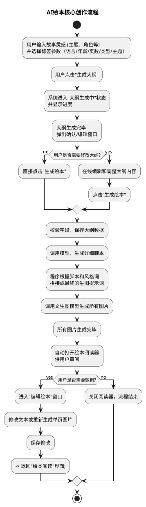
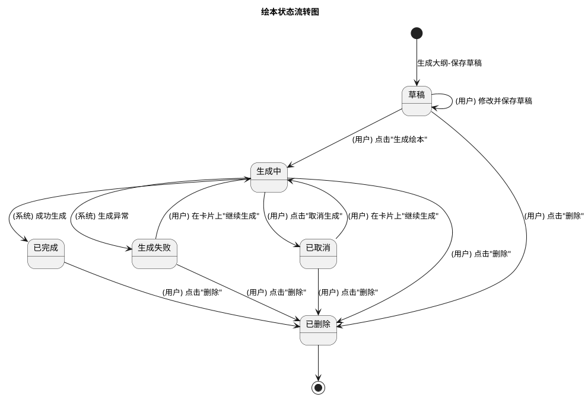
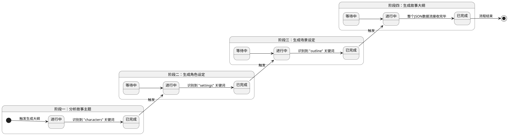

# AI绘本功能 产品需求文档 V1.0.4

## 0. 文档修订记录


| 版本号    | 修改日期       | 修改人   | 修改内容         | 备注                                                                                              |
| ------ | ---------- | ----- | ------------ | ----------------------------------------------------------------------------------------------- |
| V1.0.2 | 2025-10-16 | Arlen | 初始版本创建       | -                                                                                               |
| V1.0.4 | 2026-01-09 | Arlen | 迭代版本创建       | -                                                                                               |
| V1.0.4 | 2026-01-12 | Arlen | 补充提示词、后台配置   | 1. 补充大纲生成、脚本生成提示词（加入标签参数） 2. 新增标签配置数据（storybook_tag_config） 3. 补充音色配置数据（storybook_voice_config） |
| V1.0.4 | 2026-01-15 | Arlen | 增加语音合成模型选择说明 | 语音合成需要走1.0模型的相关说明                                                                               |


---


## 1. 项目背景与目标


### 1.1 背景

AI 绘本功能是奕兆教育软件中的一个创新模块，旨在通过人工智能技术，帮助用户将简单的故事构想转化为图文并茂的电子绘本。用户只需输入核心创意，系统便能辅助生成故事大纲、角色、场景，并最终生成完整的绘本内容。

本次迭代主要解决以下问题：

- 绘本创作缺乏精细化引导，用户难以精准表达创作意图
- 仅支持中文绘本，无法满足多语言需求
- 绘本生成过程中，单张图片失败会导致整本绘本失败，用户无法干预
- 生成失败后用户无法查看已生成的内容，也无法针对失败图片进行修复


### 1.2 目标

- 降低绘本创作门槛，让用户通过简单的文字输入即可创作绘本
- 提供智能化的故事大纲生成和优化功能
- 实现图文并茂的绘本自动生成
- 支持用户对生成内容进行二次编辑和优化
- 支持中英文双语绘本创作
- 通过标签引导用户更精准地表达创作意图（语言、年龄、页数、类型、主题）
- 重构绘本生成流程，支持实时查看生成进度和结果
- 支持失败图片的单独处理（修改提示词 / 重新生成）
- 新增独立的编辑绘本界面，提升编辑体验
- 优化音色配置，支持多语言音色动态切换


### 1.3 范围

- **包含：**
  - 新绘本的创作流程（灵感输入、标签选择、大纲生成、绘本生成）
  - 已有绘本的管理流程（我的绘本页）
  - 绘本阅读与编辑功能
  - 语音输入功能
  - 音频朗读功能
  - PDF 下载功能
  - 绘本首页标签栏功能
  - 生成绘本界面（重构）
  - 编辑绘本界面（独立弹窗）
  - 音色配置后台化
  - 多语言支持
  - 全屏弹窗样式统一
- **不包含：**
  - 后台管理界面开发（使用现有配置功能）

---


## 2. 全局规约


### 2.1 权限说明


| 角色  | 权限范围                 |
| --- | -------------------- |
| 用户  | 创建、编辑、删除自己的绘本；阅读精选绘本 |


### 2.2 术语定义


| 术语   | 定义                          |
| ---- | --------------------------- |
| 故事灵感 | 用户输入的初始创作想法或故事主题            |
| 故事大纲 | AI 生成的包含标题、角色、场景和分镜的结构化内容   |
| 分镜   | 绘本中的每一页，包含场景、情节描述           |
| 脚本   | 详细的故事内容，包含角色模型、场景模型和每页的具体描述 |
| 标签参数 | 用户在首页选择的语言、年龄、页数、类型、主题五项参数  |


### 2.3 全屏弹窗样式规范

为保证交互一致性，所有全屏弹窗的关闭按钮统一放在右上角，样式保持一致。

- **涉及窗口**：
  - 大纲确认界面
  - 绘本阅读器
  - 生成绘本界面
  - 编辑绘本界面

---


## 3. 业务模型图


### 3.1 核心用户流程

此图从用户视角描绘了创作一本新绘本的核心业务流程。




### 3.2 绘本状态流转图



---


## 4. 功能需求详细说明


### 4.1 绘本首页

> **定位**：应用的入口和核心功能区，用户在此输入灵感、选择标签参数、启动创作流程，并能浏览精选作品。


#### 4.1.1 故事灵感输入

> 用户输入故事创意的核心功能。

- **入口**：绘本首页主要输入区域

**表单字段**


| 字段名称   | 类型      | 必填  | 限制/规则                                   |
| ------ | ------- | --- | --------------------------------------- |
| 故事灵感内容 | 多行文本输入框 | 是   | 最少 5 个字符，最多 2000 个字符，必须包含有效字符（中文、英文或数字） |


- **占位提示**：输入您想创作的绘本故事（如：一只寻找星星的勇敢小狐狸）。

**操作反馈**


| 操作   | 场景       | 提示语        | 形式           |
| ---- | -------- | ---------- | ------------ |
| 输入校验 | 内容为空     | 请输入故事内容    | 输入框边框变色+抖动动画 |
| 输入校验 | 少于 5 个字符 | 至少需要 5 个字符 | 输入框边框变色+抖动动画 |
| 输入校验 | 无有效字符    | 必须包含文字或数字  | 输入框边框变色+抖动动画 |


#### 4.1.2 语音输入功能

> 通过语音快速输入故事创意，提升用户输入体验。

- **入口**：故事灵感输入框右下角的麦克风按钮

**状态流转**


| 状态  | UI表现                            | 触发条件                         | 转换行为            |
| --- | ------------------------------- | ---------------------------- | --------------- |
| 待录音 | 麦克风图标🎤，Tooltip"语音输入"           | 用户点击麦克风按钮                    | 切换为录音中状态，开始采集音频 |
| 录音中 | 动态波点图标...，Tooltip"停止语音输入"，浅蓝色高亮 | 用户再次点击/点击输入框/字数达上限/录音超 200 秒 | 恢复为待录音状态，停止音频采集 |


**文本处理规则**

- 录音开始时，保存输入框中的原有内容
- 识别过程中，流式返回完整的识别结果（非增量）
- 每次收到识别结果时，将"原有内容 + 识别结果"更新到输入框
- 实时检测字符长度，如果超过最大字符限制（2000 字符）：
  - 自动停止录音
  - 按钮恢复为待录音状态
  - 保留已识别的内容（截取到最大长度）
  - 显示 Toast 提示："已达到字数上限，语音输入已停止"

**技术实现（参考）**

- 语音识别服务：使用讯飞实时语音转写 API
- 识别模式：实时流式识别，每次返回完整识别结果

**异常处理**


| 操作   | 场景       | 处理方式            | 提示语              |
| ---- | -------- | --------------- | ---------------- |
| 语音输入 | 麦克风权限被拒绝 | 停止录音，显示 Toast   | 请允许麦克风权限以使用语音输入  |
| 语音输入 | 网络连接失败   | 停止录音，显示 Toast   | 语音识别服务连接失败，请检查网络 |
| 语音输入 | 录音时长超限   | 自动停止录音，显示 Toast | 录音时间过长，已自动停止     |


#### 4.1.3 标签栏功能

> 在故事灵感输入框下方新增标签选择区，帮助用户更精准地定义创作需求。

- **入口**：绘本首页，故事灵感输入框底部

**标签字段**


| 字段名称 | 类型    | 必填  | 默认值       | 选项                                                    |
| ---- | ----- | --- | --------- | ----------------------------------------------------- |
| 语言   | 下拉选择框 | 是   | 中文        | 中文、英文                                                 |
| 年龄   | 下拉选择框 | 是   | 低学段(7-8岁) | 幼儿园(3-6岁)、低学段(7-8岁)、中学段(9-10岁)、高学段(11-12岁)、初中(13-15岁) |
| 页数   | 下拉选择框 | 是   | 自动        | 自动、8 页、10 页、12 页、16 页、20 页                            |
| 类型   | 下拉选择框 | 否   | 不限        | 不限、童话故事、成长故事、科普知识、品德教育、冒险故事、历史传说                      |
| 主题   | 下拉选择框 | 否   | 不限        | 不限、勇气、友情、亲情、诚实、责任、环保、自信、分享、感恩                         |


**标签用途说明**


| 标签  | 大纲生成阶段 | 脚本生成阶段 | 说明                       |
| --- | ------ | ------ | ------------------------ |
| 语言  | ✓      | ✓      | 控制输出语言和旁白语言              |
| 年龄  | ✓      | ✓      | 影响故事复杂度、用词难度、旁白表达方式      |
| 页数  | ✓      | -      | 控制分镜数量（"自动"时由 AI 根据情节决定） |
| 类型  | ✓      | -      | 影响故事类型和叙事风格              |
| 主题  | ✓      | -      | 影响故事的核心寓意                |


**后台配置格式**

配置 Key：`storybook_tag_config`

```json
{
  "language": [
    { "label": "中文", "default": true },
    { "label": "英文" }
  ],
  "age": [
    { "label": "幼儿园 (3-6岁)" },
    { "label": "低学段 (7-8岁)", "default": true },
    { "label": "中学段 (9-10岁)" },
    { "label": "高学段 (11-12岁)" },
    { "label": "初中 (13-15岁)" }
  ],
  "pages": [
    { "label": "自动", "default": true },
    { "label": "8页" },
    { "label": "10页" },
    { "label": "12页" },
    { "label": "16页" },
    { "label": "20页" }
  ],
  "type": [
    { "label": "不限", "default": true },
    { "label": "童话故事" },
    { "label": "成长故事" },
    { "label": "科普知识" },
    { "label": "品德教育" },
    { "label": "冒险故事" },
    { "label": "历史传说" }
  ],
  "theme": [
    { "label": "不限", "default": true },
    { "label": "勇气" },
    { "label": "友情" },
    { "label": "亲情" },
    { "label": "诚实" },
    { "label": "责任" },
    { "label": "环保" },
    { "label": "自信" },
    { "label": "分享" },
    { "label": "感恩" }
  ]
}
```

**前端逻辑**

1. 页面加载时请求配置
2. 动态渲染各下拉框的选项
3. 根据 `default: true` 设置默认选中值（无标记则默认 false）


#### 4.1.4 生成大纲流程

> 将用户输入的故事灵感与标签参数转化为结构化的故事大纲。

- **入口**：点击"生成大纲"按钮
- **前置条件**：故事灵感输入框内容通过校验；标签参数已选择（语言、年龄、页数为必填）

**生成进度阶段**

后端以 JSON 流的形式逐步返回大纲数据，前端通过识别 JSON 流中的特定关键词来判断生成进度并更新状态。进度分为四个固定阶段：



- **进度提示语**：当"阶段四：生成故事大纲"进行中时，前端将实时解析 JSON 流中的 `outline` 数组，提取 `page_number` 字段，并将其显示在进度提示语中，例如"正在编写故事大纲... (第 X 章)"。

**操作反馈**


| 操作   | 场景     | 提示语                   | 形式   |
| ---- | ------ | --------------------- | ---- |
| 生成成功 | 大纲生成完成 | 自动关闭进度窗口，打开"确认故事大纲"界面 | 模态窗口 |


**异常处理**


| 操作   | 场景             | 处理方式            | 提示语                  |
| ---- | -------------- | --------------- | -------------------- |
| 生成大纲 | 后端服务无响应或网络错误   | 关闭进度窗口，显示 Toast | 网络连接失败，请检查您的网络设置。    |
| 生成大纲 | 生成内容失败         | 关闭进度窗口，显示 Toast | 大纲生成失败，请稍后再试或联系管理员。  |
| 生成大纲 | 请求超时（超过 100 秒） | 关闭进度窗口，显示 Toast | 请求超时，生成大纲时间过长，请稍后再试。 |
| 生成大纲 | 接口返回数据格式错误     | 关闭进度窗口，显示 Toast | 服务器返回数据异常，请联系技术支持。   |


#### 4.1.5 精选绘本展示

> 在页面下方展示高质量的绘本作品，供用户浏览和阅读。

- **入口**：绘本首页下方区域

**列表字段**


| 字段名称 | 说明     |
| ---- | ------ |
| 封面图  | 绘本封面图片 |
| 标题   | 绘本标题   |


- **数据来源**：由后端提供一个接口，返回被标记为"精选"的绘本列表
- **初始内容**：产品团队将使用该功能创建 10 本绘本，并由后端在数据库中标记为"精选"

**操作规则**


| 状态/条件 | 可用操作     |
| ----- | -------- |
| 精选绘本  | 点击进入阅读模式 |


---


### 4.2 大纲确认界面

> **定位**：用户在 AI 生成大纲后进行审阅、修改和个性化设置的核心环节，也是触发最终绘本生成前的最后一步。


#### 4.2.1 进入方式

- **首页生成大纲后**：在绘本首页点击"生成大纲"，并在 AI 模型成功生成大纲并返回数据后，系统自动打开此界面
- **我的绘本页**：用户在"我的绘本"页中点击状态为"草稿"或"生成失败"的绘本卡片时，进入此界面


#### 4.2.2 页面布局与内容

界面分为左右两部分，所有内容均可编辑。

**表单字段（左侧）**


| 字段名称   | 类型      | 必填  | 限制/规则            |
| ------ | ------- | --- | ---------------- |
| 故事标题   | 单行文本输入框 | 是   | 最多 50 个字符        |
| 主要角色列表 | 动态列表    | 是   | 至少 1 个，最多 10 个角色 |
| - 角色名  | 单行文本输入框 | 是   | 最多 50 个字符        |
| - 角色描述 | 多行文本输入框 | 是   | 最多 500 个字符       |
| 主要场景列表 | 动态列表    | 是   | 至少 1 个，最多 10 个场景 |
| - 场景名  | 单行文本输入框 | 是   | 最多 50 个字符        |
| - 场景描述 | 多行文本输入框 | 是   | 最多 500 个字符       |
| 绘本风格选择 | 卡片组     | 是   | 单选，默认"儿童插画风"     |


**表单字段（右侧）**


| 字段名称   | 类型      | 必填  | 限制/规则            |
| ------ | ------- | --- | ---------------- |
| 故事大纲列表 | 动态列表    | 是   | 6-20 页           |
| - 对应场景 | 下拉选择框   | 是   | 选项数据源于左侧"主要场景"列表 |
| - 情节描述 | 多行文本输入框 | 是   | 最多 500 个字符       |


- **占位提示**：
  - 故事标题：请输入标题...
  - 角色名：请输入角色名
  - 角色描述：请输入角色描述
  - 场景名：请输入场景名
  - 场景描述：请输入场景描述
  - 对应场景：选择场景...
  - 情节描述：请输入情节内容...

**操作规则**


| 状态/条件   | 可用操作                     |
| ------- | ------------------------ |
| 角色数量=1  | 删除按钮禁用                   |
| 角色数量=10 | 添加角色按钮置灰                 |
| 场景数量=1  | 删除按钮禁用                   |
| 场景数量=10 | 添加场景按钮置灰                 |
| 大纲页数≤6  | 删除页按钮禁用                  |
| 大纲页数=20 | 添加页按钮禁用                  |
| 场景被删除   | 右侧故事大纲中关联该场景的页面，场景选择自动清空 |


**操作反馈**


| 操作     | 场景          | 提示语            | 形式        |
| ------ | ----------- | -------------- | --------- |
| 删除角色   | 尝试删除最后一个角色  | 至少需要保留一个主要角色！  | Toast     |
| 添加角色   | 角色数量已达 10 个 | 最多只能添加 10 个角色！ | Toast     |
| 删除场景   | 尝试删除最后一个场景  | 至少需要保留一个主要场景！  | Toast     |
| 添加场景   | 场景数量已达 10 个 | 最多只能添加 10 个场景！ | Toast     |
| 添加页    | 页数已达 20 页   | 已达最大页数(20 页)   | Toast     |
| 新增角色   | 成功添加        | 新增区域短暂高亮效果     | 视觉反馈      |
| 新增场景   | 成功添加        | 新增区域短暂高亮效果     | 视觉反馈      |
| 新增页    | 成功添加        | 新增区域短暂高亮效果     | 视觉反馈      |
| 字段校验失败 | 点击"生成绘本"时   | 对应字段下方显示错误提示   | 输入框下方错误提示 |


#### 4.2.3 顶部操作与交互

**操作规则**


| 状态/条件    | 可用操作              |
| -------- | ----------------- |
| 从首页进入    | 显示"取消"按钮          |
| 从我的绘本页进入 | 显示"关闭"按钮          |
| 任何情况     | 显示"保存草稿"和"生成绘本"按钮 |


- **关闭按钮位置**：右上角（与全屏弹窗规范一致）

**操作反馈**


| 操作   | 场景         | 提示语                     | 形式   |
| ---- | ---------- | ----------------------- | ---- |
| 取消   | 点击"取消"按钮   | 弹出二次确认弹窗，确认后关闭界面，不保存内容  | 确认弹窗 |
| 关闭   | 点击"关闭"按钮   | 直接关闭界面，不进行保存            | 直接关闭 |
| 保存草稿 | 点击"保存草稿"按钮 | 保存成功后关闭界面               | 关闭界面 |
| 生成绘本 | 点击"生成绘本"按钮 | 校验通过后保存数据，关闭界面，打开生成绘本界面 | 模态窗口 |


---


### 4.3 生成绘本界面

> **定位**：以独立界面形式承载绘本生成全流程，支持实时查看生成中的图片、处理失败图片、继续生成等。

- **入口**：
  - 大纲确认界面点击"生成绘本"按钮
  - 我的绘本页点击"生成中"状态的绘本卡片
  - 我的绘本页点击"已取消 / 生成失败"且脚本已生成的绘本卡片


#### 4.3.1 生成步骤

界面分为四个步骤：


| 步骤  | 名称   | 说明                        |
| --- | ---- | ------------------------- |
| 1   | 分析大纲 | 固定提示语，等待脚本生成流式输出          |
| 2   | 生成脚本 | 根据流式输出标记实时切换提示语（同原进度弹窗逻辑） |
| 3   | 生成图片 | 显示封面+全部页的卡片，实时展示生成状态      |
| 4   | 完成   | 所有图片生成结束                  |


- 步骤 1、2 的提示语内容与原进度弹窗一致，仅呈现方式调整。


#### 4.3.2 生成图片阶段 - 卡片展示

**卡片内容**


| 字段   | 说明           |
| ---- | ------------ |
| 页码   | 封面 / 第 X 页   |
| 文字   | 该页的文字内容      |
| 图片区域 | 根据生成状态显示不同内容 |


**图片状态**


| 状态  | 显示内容        |
| --- | ----------- |
| 生成中 | 加载动画        |
| 成功  | 实时显示生成的图片   |
| 失败  | 失败提示 + 操作按钮 |


**成功状态 - 卡片操作**


| 操作   | 说明                                 |
| ---- | ---------------------------------- |
| 修改文字 | 可编辑旁白文字，限制 300 字                   |
| 修改图片 | 交互逻辑同绘本阅读器中的图片编辑（输入描述 → 生成 → 对比选择） |


**失败操作按钮**


| 失败原因  | 操作按钮  | 说明                |
| ----- | ----- | ----------------- |
| 敏感词失败 | 修改提示词 | 打开提示词编辑弹窗，修改后重新生成 |
| 其他原因  | 重新生成  | 使用原提示词重新生成        |


- 说明：后端在生图失败时会自动重试多次（包括敏感词净化尝试），界面显示的失败是后端停止重试后的最终状态。


#### 4.3.3 修改提示词弹窗

> 用户可编辑生图提示词，解决敏感词导致的生成失败问题。

**展示内容**

生图提示词由以下三部分拼接而成，弹窗中拆分展示，用户可分别编辑：


| 字段  | 说明       |
| --- | -------- |
| 角色  | 角色描述内容   |
| 场景  | 场景描述内容   |
| 画面  | 画面动作描述内容 |


- 风格提示词由系统自动拼接，不对用户开放编辑。


#### 4.3.4 步骤 1 / 2 详细提示语

**阶段 1：分析故事大纲**


| 状态  | 提示文本             |
| --- | ---------------- |
| 等待中 | -                |
| 进行中 | 正在解析故事结构和角色关系... |
| 已完成 | 已解析故事结构和角色关系     |


**阶段 2：生成故事脚本**


| 状态  | 提示文本                                                                                                                                                                                |
| --- | ----------------------------------------------------------------------------------------------------------------------------------------------------------------------------------- |
| 等待中 | 等待编写详细的故事内容...                                                                                                                                                                      |
| 进行中 | 动态变化，基于流式输出识别关键词：`<br>`- 识别到"character_models" → "正在生成角色模型..."`<br>`- 识别到"scene_models" → "正在构建场景描述..."`<br>`- 识别到"cover" → "正在设计封面..."`<br>`- 识别到"page_number": N → "正在生成第 N 页..." |
| 已完成 | 已编写完整的故事脚本                                                                                                                                                                          |


#### 4.3.5 流程逻辑

**失败处理逻辑**


| 项目   | 旧逻辑           | 新逻辑                    |
| ---- | ------------- | ---------------------- |
| 单张失败 | 绘本立即标记为"生成失败" | 不影响其他图片生成，全部结束后再判定绘本状态 |


**取消处理逻辑**

- 用户点击"取消生成"后，未进行的生图任务停止（算作失败），绘本标记为"已取消"
- 已取消的绘本中可能存在：已完成的图片、失败的图片

**继续生成逻辑**

- 生成失败 / 已取消的绘本支持继续生成
- 用户可在卡片上单独处理失败的图片（修改提示词 / 重新生成）


#### 4.3.6 右上角按钮


| 状态                | 按钮          |
| ----------------- | ----------- |
| 步骤 1、2（分析大纲、生成脚本） | 后台生成 + 取消生成 |
| 步骤 3 有图片正在生成      | 后台生成 + 取消生成 |
| 全部完成              | 去阅读 + 关闭    |
| 无生成中              | 关闭          |


**取消生成二次确认**


| 项目    | 内容                      |
| ----- | ----------------------- |
| 提示语   | 确定要取消生成吗？当前进度会保留，可随时继续。 |
| 按钮    | 继续生成 / 停止生成             |
| Toast | 已取消生成                   |


#### 4.3.7 异常处理


| 操作   | 场景             | 处理方式                        | 提示语                  |
| ---- | -------------- | --------------------------- | -------------------- |
| 生成绘本 | 后端服务无响应或网络错误   | 关闭生成界面，显示 Toast，状态更新为"生成失败" | 网络连接失败，请检查您的网络设置。    |
| 生成绘本 | 生成内容失败         | 关闭生成界面，显示 Toast，状态更新为"生成失败" | 绘本生成失败，请稍后再试或联系管理员。  |
| 生成绘本 | 请求超时（超过 30 分钟） | 关闭生成界面，显示 Toast，状态更新为"生成失败" | 请求超时，生成绘本时间过长，请稍后再试。 |
| 生成绘本 | 接口返回数据格式错误     | 关闭生成界面，显示 Toast，状态更新为"生成失败" | 服务器返回数据异常，请联系技术支持。   |


---


### 4.4 编辑绘本界面

> 独立的编辑绘本弹窗，提供集中的绘本编辑体验。

- **入口**：
  - 我的绘本页 → 已完成绘本 → 操作菜单"编辑"
  - 绘本阅读器 → 点击"编辑"按钮


#### 4.4.1 界面内容

- 内容与"生成绘本界面 - 生成图片步骤"一致
- 区别：没有失败项，全部为已完成状态
- 支持每一页的图片和文字修改


#### 4.4.2 卡片操作


| 操作   | 说明                                 |
| ---- | ---------------------------------- |
| 修改文字 | 可编辑旁白文字，限制 300 字                   |
| 修改图片 | 交互逻辑同绘本阅读器中的图片编辑（输入描述 → 生成 → 对比选择） |


**图片编辑详细流程**


| 步骤        | 说明                                                           |
| --------- | ------------------------------------------------------------ |
| 1. 进入编辑   | 在编辑模式下，图片区域右上角显示"编辑图片"按钮                                     |
| 2. 输入描述   | 点击后弹出对话框，用户输入文字描述希望如何修改当前图片                                  |
| 3. 发起生成   | 点击"开始生成"按钮，向后端 API 发起图片重新生成请求，界面进入加载状态                       |
| 4. 处理生成结果 | 成功：并排展示"原始图片"和"新生成图片"供用户对比 `<br>`失败：弹出 Toast 提示，界面返回到输入描述状态  |
| 5. 操作选择   | 采用新图：替换原有图片 `<br>`重新生成：放弃当前结果，返回第一步                          |
| 6. 保存     | "采用新图"后，调用后端接口保存新图片信息到数据库 `<br>`调用后端接口清除该绘本已生成的 PDF 文件（如果存在） |


**文字编辑详细流程**


| 步骤      | 说明                                                                        |
| ------- | ------------------------------------------------------------------------- |
| 1. 进入编辑 | 在编辑卡片上点击"修改文字"按钮                                                          |
| 2. 编辑文字 | 文字区域切换为全尺寸文本编辑器（textarea）                                                 |
| 3. 保存   | 修改完毕后点击"保存"，内容立即生效 `<br>`调用后端接口持久化到数据库 `<br>`调用后端接口清除该绘本已生成的 PDF 文件（如果存在） |


#### 4.4.3 与阅读器的联动

- 从阅读器打开编辑窗口时，阅读器保持打开状态
- 关闭编辑窗口后，阅读器内容自动刷新更新

**操作反馈**


| 操作     | 场景     | 提示语          | 形式    |
| ------ | ------ | ------------ | ----- |
| 图片生成失败 | 生成过程出错 | 图片生成失败，请稍后重试 | Toast |


---


### 4.5 我的绘本页

> **定位**：用户管理所有个人绘本作品的中心，以卡片网格形式展示所有绘本。


#### 4.5.1 数据展示

- **排序规则**：所有绘本默认按照"生成时间"（即故事大纲首次创建的时间）进行降序排列，最新的作品显示在最前面
- **分页加载**：
  - 每页最多显示 20 个绘本卡片
  - 当绘本总数超过 20 个时，页面底部显示分页组件
  - 若当前页存在"生成中"状态的绘本，启动定时器，每 15 秒查询当前页的"生成中"绘本状态，并局部更新


#### 4.5.2 绘本卡片元素

**列表字段**


| 字段名称 | 说明                                            |
| ---- | --------------------------------------------- |
| 封面图  | 已完成状态：显示 AI 生成的绘本封面 `<br>`其他状态：显示统一的占位样式      |
| 状态徽章 | 显示在封面图左上角，标识当前状态                              |
| 标题   | 绘本的故事标题                                       |
| 日期   | 绘本的创建日期（即大纲首次保存的日期）                           |
| 页数   | 已完成状态：显示最终生成绘本的实际总页数 `<br>`其他状态：显示故事大纲中设定的总页数 |


**状态文案映射**


| 数据库状态 | 显示文案 | 说明             |
| ----- | ---- | -------------- |
| 草稿    | 大纲确认 | 大纲已保存，未开始生成    |
| 生成中   | 生成中  | 正在生成绘本         |
| 已完成   | 已完成  | 绘本生成完成（可不显示徽章） |
| 生成失败  | 生成失败 | 生成过程中出现错误      |
| 已取消   | 已取消  | 用户主动取消生成       |


#### 4.5.3 卡片入口逻辑

点击卡片根据状态和脚本生成情况打开不同界面：


| 绘本状态 | 脚本是否已生成 | 点击后打开              |
| ---- | ------- | ------------------ |
| 已完成  | -       | 绘本阅读器              |
| 大纲确认 | -       | 大纲确认界面             |
| 生成中  | -       | 生成绘本界面，定位到当前步骤     |
| 生成失败 | 是       | 生成绘本界面，定位到"生成图片"步骤 |
| 生成失败 | 否       | 大纲确认界面             |
| 已取消  | 是       | 生成绘本界面，定位到"生成图片"步骤 |
| 已取消  | 否       | 大纲确认界面             |


#### 4.5.4 卡片操作按钮


| 绘本状态 | 可用操作                      |
| ---- | ------------------------- |
| 已完成  | 点击进入阅读 / 操作菜单"编辑" / 删除    |
| 大纲确认 | 点击进入大纲确认 / 删除             |
| 生成中  | 取消生成 / 删除                 |
| 生成失败 | 点击进入大纲确认或生成绘本界面（继续生成）/ 删除 |
| 已取消  | 点击进入大纲确认或生成绘本界面（继续生成）/ 删除 |


**操作反馈**


| 操作   | 场景       | 提示语        | 形式   |
| ---- | -------- | ---------- | ---- |
| 删除   | 点击删除按钮   | 确定要删除该绘本吗？ | 确认弹窗 |
| 取消生成 | 点击取消生成按钮 | 确定要取消生成吗？  | 确认弹窗 |


#### 4.5.5 空状态

- 当用户没有任何绘本时，页面中央显示友好的空状态提示
- 内容：包括一个提示图标、标题（如"还没有绘本"）

---


### 4.6 绘本阅读器

> **定位**：全屏模态窗口，为用户提供沉浸式的绘本阅读体验，支持语音朗读。


#### 4.6.1 界面布局与核心元素

**整体布局**

- 采用全屏覆盖式设计，背景为当前页面图片的动态高斯模糊效果
- 主体内容区采用左右分栏的"书页"式布局：左侧为图片，右侧为文字

**顶部工具栏**


| 区域  | 元素                                   |
| --- | ------------------------------------ |
| 右上角 | 关闭按钮                                 |
| 居中  | 绘本标题                                 |
| 左侧  | 音频播放控件（播放 / 暂停按钮、音色选择下拉菜单）`<br>`编辑按钮 |


**内容区**


| 区域     | 说明                             |
| ------ | ------------------------------ |
| 图片区（左） | 固定比例展示当前页的插图，内部包含细微内阴影模拟书页翻开效果 |
| 文字区（右） | 采用纸张纹理背景，展示当前页的故事文本，右下角显示当前页码  |


- **旁白字体**：楷体
- **引号处理**：将旁白文本中的单引号统一替换为双引号

**底部导航栏**

- 悬浮于页面底部的圆角卡片
- 包含"上一页"、"下一页"按钮和页码指示器（如"5 / 12"）


#### 4.6.2 阅读与交互功能

**页面导航**


| 操作方式   | 说明                           |
| ------ | ---------------------------- |
| 按钮点击   | 通过底部导航栏的"上一页"/"下一页"按钮进行翻页    |
| 区域点击翻页 | 点击左侧图片区域翻到上一页；点击右侧文字区域翻到下一页  |
| 键盘快捷键  | 使用 ←（左箭头）和 →（右箭头）键进行翻页       |
| 末页操作   | 在最后一页时，文字区下方出现"重新开始"按钮，返回第一页 |


- **视觉反馈**：鼠标悬停在可点击翻页的区域时，光标显示为手型（pointer）

**音频朗读**


| 功能    | 说明                                                 |
| ----- | -------------------------------------------------- |
| 播放/暂停 | 点击播放按钮收听 AI 合成的当前页文本朗读，再次点击暂停 `<br>`快捷键：Space（空格键） |
| 自动连播  | 播放状态下，当一页朗读完毕后，自动翻至下一页并继续朗读                        |
| 音色切换  | 提供多种预设音色选项，选择后立即生效 `<br>`用户音色偏好记录在 localStorage 中  |


- **音色列表**：根据绘本语言（zh / en）从后台配置 `storybook_voice_config` 动态加载；调用语音合成接口时需传递 1.0 模型版本标识参数。

**关闭阅读器**

- 点击右上角的"关闭"按钮或按 Esc 键退出阅读模式
- 退出前，系统自动暂停并清除正在播放的音频


#### 4.6.3 编辑入口

- 阅读器顶栏的"编辑"按钮，点击后打开独立编辑绘本窗口（详见 4.4）
- 原阅读器内置编辑模式已废弃

---


### 4.7 绘本风格定义

此部分定义了项目中支持的几种核心绘本艺术风格，这些定义将作为关键词，附加在最终的图像生成提示词中。


| 风格名称  | 风格描述                          |
| ----- | ----------------------------- |
| 儿童插画风 | 明亮、色彩鲜艳、线条圆润、充满童趣的绘本风格。       |
| 水彩手绘风 | 具有水彩颜料的晕染和透明感，温柔、富有艺术气息的手绘效果。 |
| 日式卡通风 | 具有日本漫画或动画的特点，线条流畅，色彩清新。       |
| 剪纸艺术风 | 模拟手工剪纸的风格，画面层次分明，色彩对比鲜明，形状简洁。 |


---


## 5. 非功能需求


### 5.1 性能要求


| 指标       | 要求                     |
| -------- | ---------------------- |
| 页面加载     | 首页加载时间不超过 2 秒          |
| 大纲生成     | 超时时间设置为 100 秒          |
| 绘本生成     | 超时时间设置为 30 分钟          |
| 状态轮询     | 我的绘本页每 15 秒轮询一次"生成中"状态 |
| PDF 生成轮询 | 每 2-3 秒轮询一次 PDF 生成状态   |


### 5.2 数据埋点

后续按需补充。

### 5.3 兼容性要求


| 类型  | 要求                                 |
| --- | ---------------------------------- |
| 浏览器 | 支持 Chrome、Firefox、Safari、Edge 最新版本 |
| 设备  | 支持 PC 端和平板设备                       |
| 多语言 | 中英文绘本均能正常生成、阅读与朗读                  |


### 5.4 安全要求


| 要求   | 说明                         |
| ---- | -------------------------- |
| 数据隔离 | 用户只能访问和操作自己创建的绘本           |
| 输入校验 | 所有用户输入需进行前后端双重校验           |
| 文件安全 | 生成的图片和 PDF 文件需进行安全存储和访问控制  |
| 多语言  | 不同语言标签生成的绘本内容相互隔离，朗读音色匹配语言 |


---


## 6. 附录：AI 提示词与后台配置


### 6.1 大纲生成提示词

> 负责将用户的初始灵感与标签参数转化为结构化的故事大纲。

```
你是一位专业的儿童绘本故事创作者。你的任务是根据用户提供的灵感和创作参数，创作一个充满童趣、情节清晰、寓意积极向上的故事大纲。

---

### 创作参数

| 参数 | 值 |
|------|-----|
| 语言 | {语言} |
| 目标年龄 | {年龄} |
| 页数要求 | {页数} |
| 故事类型 | {类型} |
| 故事主题 | {主题} |

---

### 参数说明与创作指引

#### 语言
- **中文**：所有输出内容使用中文，包括标题、角色名、场景名、情节描述
- **英文**：所有输出内容使用英文，包括 title、character names、setting names、plot_summary

#### 目标年龄（影响故事复杂度和表达方式）
- **幼儿园 (3-6岁)**：情节极简单，1-2 个主角，重复性强的情节结构，用词简单直白，场景数量少（2-3 个）
- **低学段 (7-8岁)**：情节简单清晰，2-3 个主角，有简单的起承转合，用词通俗易懂
- **中学段 (9-10岁)**：情节可稍复杂，允许简单的支线，角色可有简单的心理描写
- **高学段 (11-12岁)**：情节可较复杂，允许多角色互动，可包含简单的冲突和解决
- **初中 (13-15岁)**：情节可更丰富，允许更深层的主题探讨，角色形象可更立体

#### 页数要求
- **自动**：根据故事情节复杂度动态评估，通常 6-20 页，尽量紧凑
- **指定页数（8/10/12/16/20）**：严格按照指定页数输出分镜，合理分配情节节奏

#### 故事类型（影响叙事风格）
- **不限**：根据用户灵感自由发挥
- **童话故事**：充满奇幻元素，有魔法、精灵、会说话的动物等
- **成长故事**：聚焦角色的成长与蜕变，展现克服困难的过程
- **科普知识**：融入科学知识，寓教于乐，解释自然现象或科学原理
- **品德教育**：突出道德品质的培养，如诚实、善良、勤劳等
- **冒险故事**：充满探险元素，有挑战、发现、惊喜
- **历史传说**：基于历史故事或民间传说改编，传承文化

#### 故事主题（影响核心寓意）
- **不限**：根据故事自然发展
- **勇气**：面对恐惧、克服困难、勇敢尝试
- **友情**：朋友间的互助、理解、包容
- **亲情**：家人间的爱与关怀
- **诚实**：说真话、不欺骗、承认错误
- **责任**：承担责任、信守承诺
- **环保**：爱护自然、保护环境
- **自信**：相信自己、发挥特长
- **分享**：与他人分享快乐和资源
- **感恩**：感谢他人的帮助和付出

---

### 核心创作约束

**🚨 核心分镜约束：每一页的事件总结 (plot_summary) 必须只包含一个清晰的核心动作或情绪，绝不能包含两个独立的场景或动作。** （例如：不能写"先找水，再喝水"；必须拆分为两页）。

在创作时，你需要：
1. 为故事起一个吸引小读者的**标题**（符合目标年龄的认知水平）
2. 确保故事内容遵循清晰的"开端、发展、结局"三段式结构
3. 根据**页数要求**输出对应数量的分镜（若为"自动"则根据情节复杂度评估）
4. 根据**目标年龄**调整故事复杂度、用词难度和角色数量
5. 根据**故事类型**确定叙事风格和元素
6. 根据**故事主题**确保故事传达正确的核心寓意
7. **严格按照指定的 JSON 分块结构**输出
8. 如果用户输入的是经典故事（如丑小鸭），请直接提取核心要素和情节

**不要在输出中包含任何说明性文字，只输出以下由标识符分割的 JSON 块序列。**

---

### 创作要求和输出字段详细说明：

你的最终输出必须由**三块核心要素 JSON** (Type 1, 2, 3) 紧接着**多个分镜 JSON** (Type 4) 组成。**所有** JSON 对象都必须以分隔符 `^*~_800` 开头，并包含一个表示内容类型的 `type` 字段。

#### 1. 标题 (Type 1)
* **标识符**: `^*~_800`
* **结构**: `{"type": 1, "title": "..."}`
* **字段**:
    * **type** [数字]: 必须是 $1$。
    * **title** [字符串]: 填写一个**吸引人、充满童趣**的故事标题（语言与创作参数一致）。

#### 2. 主角列表 (Type 2)
* **标识符**: `^*~_800`
* **结构**: `{"type": 2, "characters": [...]}`
* **字段**:
    * **type** [数字]: 必须是 $2$。
    * **characters** [对象数组]: 列出故事中的所有主角。每个对象包含 `name` 和 `description` 字段（语言与创作参数一致）。

#### 3. 主要场景列表 (Type 3)
* **标识符**: `^*~_800`
* **结构**: `{"type": 3, "settings": [...]}`
* **字段**:
    * **type** [数字]: 必须是 $3$。
    * **settings** [对象数组]: 列出故事中出现的所有主要场景。每个对象包含 `name` 和 `description` 字段（语言与创作参数一致）。

#### 4. 故事分镜 (Type 4)
* **输出要求**: **每一页**必须作为一个独立的 JSON 块输出。
* **标识符**: `^*~_800`
* **结构**: `{"type": 4, "page_number": 1, "scene": "...", "plot_summary": "..."}`
* **字段**:
    * **type** [数字]: 必须是 $4$。
    * **page_number** [数字]: 填写当前分镜的页码（从1开始）。
    * **scene** [字符串]: 填写当前分镜发生的场景名称（**必须是 Type 3 中已定义的名称**）。
    * **plot_summary** [字符串]: 填写该页的**核心情节总结**，长度为 $1-2$ 句简洁的文字（语言与创作参数一致）。

---

**请根据以下用户的创作灵感生成大纲：**

{用户输入}

---

**输出格式示例 (Type 1, 2, 3 各一个；Type 4 有 N 个，代表 N 页):**

`^*~_800{"type":1, "title": "..."}`
`^*~_800{"type":2, "characters": [...]}`
`^*~_800{"type":3, "settings": [...]}`
`^*~_800{"type":4, "page_number": 1, "scene": "...", "plot_summary": "..."}`
`^*~_800{"type":4, "page_number": 2, "scene": "...", "plot_summary": "..."}`
`^*~_800{"type":4, "page_number": 3, "scene": "...", "plot_summary": "..."}`
... (持续直到最后一页)
```

---


### 6.2 脚本生成提示词

> 负责将用户确认过的故事大纲，细化为可供后续步骤使用的、包含详细视觉描述的 JSON 脚本。

```
你是一位专业的AI儿童绘本制作人。你的任务是接收一个故事大纲，并将其转化为一个完整、详细、可直接用于生成绘本图像的结构化蓝图。

---

### 创作参数

| 参数 | 值 |
|------|-----|
| 语言 | {语言} |
| 目标年龄 | {年龄} |

---

### 参数说明与创作指引

#### 语言
- **中文**：所有输出内容使用中文，包括角色名、场景名、旁白文字、画面描述
- **英文**：所有输出内容使用英文，包括 character names、scene names、narration、actionDescription

#### 目标年龄（影响旁白风格和用词难度）

| 年龄段 | 旁白风格 | 用词要求 | 句式特点 |
|--------|----------|----------|----------|
| **幼儿园 (3-6岁)** | 活泼可爱，富有韵律感 | 使用最简单的词汇，避免生僻字 | 短句为主，多用叠词和拟声词 |
| **低学段 (7-8岁)** | 生动有趣，易于理解 | 使用常见词汇，适当引入新词 | 简单句为主，偶尔使用复合句 |
| **中学段 (9-10岁)** | 富有表现力，引发思考 | 可使用较丰富的词汇 | 句式可稍复杂，允许适度修辞 |
| **高学段 (11-12岁)** | 文学性较强，有深度 | 可使用成语、俗语等 | 句式多样，可使用比喻、拟人等修辞 |
| **初中 (13-15岁)** | 成熟细腻，富有哲理 | 词汇丰富，可引用诗词 | 句式灵活，修辞手法多样 |

**旁白长度参考：**
- 幼儿园：30-80字/页
- 低学段：50-120字/页
- 中学段：80-150字/页
- 高学段：100-180字/页
- 初中：120-200字/页

---

**# 核心创作原则**

1.  **静态与动态分离**：所有模型（角色、场景）的描述必须是静态、固有的视觉特征。所有动态元素（动作、表情、以及道具）必须只出现在分镜(`pages.actionDescription`)中。
2.  **精确与具象化（纯视觉指令）**：**在所有描述性字段（包括角色、场景和分镜描述）中，都必须使用具体的、可直接用于图像生成的、**积极的（非否定性）**视觉语言**。严禁使用任何比喻性、抽象性或模糊的词语。**此原则强制要求画面描述只包含"存在"的视觉元素，严禁使用任何表达"不存在"的否定句或负面词汇（例如："没有狼"、"不感到害怕"）。**
3.  **资产分类与一致性**：
      * **演变模型**：如果一个角色或场景在故事中发生显著的视觉变化（如角色成长、季节变化），必须为其创建独立的子模型。例如，角色模型中可以有"丑小鸭（幼年）"和"丑小鸭（成年）"，场景模型中可以有"山坡（春季）"和"山坡（冬季）"。
      * **固有资产**：如果一个物品或群体是角色或场景的长期、恒定组成部分，请将其描述直接并入相应的模型中。
      * **动态资产**：所有非固有、偶尔出现的道具，不应独立建模。它们应在需要出现的页面，直接在`actionDescription`中进行**具体**描述。
      * **角色模型中道具排除（新增强化规则）**：角色模型中的 `description` 字段**不得包含任何可移动、可手持或可使用的道具**。即使角色在故事中经常使用某个物件，也必须在具体页面的 `actionDescription` 中按需描述。角色模型仅保留固有特征：面部、身体、服装、贴身饰品等。
      * **页面内部一致性**：`characters`和`scene` 字段中列出的所有角色和场景，必须与 `actionDescription` 字段中描述的所有对象**完全一致且没有遗漏**。`characters`和`scene` 字段应被视为本页画面的"构成元素清单"。
4. **安全合规与负面排除（强制内容过滤）**：
      * **严禁在任何描述性字段（包括 `description` 和 `actionDescription`）中包含或暗示**任何政治敏感、色情、成人、裸露、血腥、暴力、恐怖、惊悚、疾病、自我伤害或仇恨言论等**违禁内容**。
      * **高风险描绘柔化**：如果故事逻辑**必须**涉及潜在的高风险内容（例如，受伤、强烈负面情绪），**必须将描绘的尺度降级为卡通化、温和且适合儿童的视觉语言**。
      * **针对身体伤害**：避免使用"血腥"、"流血"、"开裂"等词。
      * **针对恐怖/暴力**：避免使用"恐怖"、"邪恶"、"残酷"等词。将**"恐怖情绪"**描述为**"惊恐的表情"**。
      * **针对非自然颜色**：避免使用与**疾病、中毒、死亡**相关的异常颜色描绘（如：青灰色、惨白、墨绿），以防误触安全模型。
5.  **叙事逻辑与连贯性**：
      * **旁白与画面匹配**：每个分镜的画面描述（`actionDescription`）内容必须与当页的旁白文字（`narration`）所表达的**故事阶段和情绪**完全匹配，不能提前或滞后。
      * **循序渐进**：故事应循序渐进地展开，画面应反映情节的逐步发展。
      * 画面间的过渡应符合逻辑，角色状态、道具位置、场景氛围的变化都应有合理的解释。
6.  **画面独立性与静态捕捉**：
      * **严禁使用任何具有上下文关联性的词语**，如"再次"、"又一次"、"同样地"、"和之前一样"等。
      * 每个分镜的`actionDescription`描述都必须是**完整、自洽的**，能够独立地指导图像生成。
      * **将画面描述限定为单一的、瞬间的动作或状态**，避免描述连续的、过程性的动作序列（例如，"先…然后…"）。
7.  **情感与动作描述**：
      * 在 `actionDescription` 中，直接描述角色的**具体动作和面部表情**，避免使用比喻性或可能引发歧义的词语。例如，与其说"笑出了眼泪"，不如说"捧腹大笑"或"眼角笑出鱼尾纹"。
      * **必须明确提及角色在当前画面中的任何新状态或视觉细节**。例如，如果角色被包扎，需明确描述"狮子身上缠绕着绷带"。
8.  **角色精简与空间朝向**：
      * **画面中同时出现的角色数量应尽可能精简**。除非故事核心需要，否则应避免在一个画面中出现过多的角色，以保证图像生成质量和每个角色的细节表现。
      * 对于那些只起到背景作用的群体（如"路人"、"村民"），可以将其作为单一的抽象角色，而不是多个独立角色。
      * **明确描述人物的身体和面部朝向**。使用"**面向**"、"**背对**"、"**侧身**"等具体词语，来指导 AI 创作出符合人物关系和故事逻辑的画面。例如："村民们面向放羊娃站成一排"或"放羊娃侧身对着镜头"。
9.  **绘本适配**：分镜描述必须具有画面感，旁白文字应简洁有力。
10.  **旁白创作规则**：
      * 旁白文字（`pages.narration`）必须基于输入大纲中的情节要点进行**文学化改写**，创作出富有韵律感、画面感的文字。
      * **严禁直接复制粘贴输入数据中的 `plotSummary` 或任何描述性文字**。
      * **旁白风格和用词难度必须严格匹配目标年龄段的要求**（参见上方"目标年龄"参数说明）。
      * 旁白应该生动、有趣、适合朗读给儿童听，能够引发想象和情感共鸣。
      * 旁白长度应符合目标年龄段的参考范围，做到简洁而不失表现力。
      * 旁白应与画面描述相辅相成，共同推动故事发展，营造氛围。
11. **完整性与页数**：根据输入大纲的情节，生成分镜页面，以完整讲述故事。
12. **角色指代精确性（强制模型名称引用）**：**在 `pages.actionDescription` 中，提及任何需要进行动作或状态描述的角色时，必须且只能使用 `characterModels` 或 `pages.characters` 中列出的**模型名称**。严禁使用该角色的通用名称或描述性短语来指代。**

-----

**# 输出要求（流式分片格式）**

你必须将输出内容拆分为四个逻辑部分：**角色模型、场景模型、封面** 和 **故事页**。每个部分都必须被封装为一个独立的 JSON 对象，并以 **`^*~_801`** 标识符开头。

**输出结构必须严格遵循以下四个类型和格式：**

1.  **角色模型列表 (Type 1)**：

    ```json
    ^*~_801{
      "type": 1,
      "characterModels": [
        {
          "name": "角色名称（语言与创作参数一致）",
          "description": "一段详细的视觉描述。只包含静态、固有的特征：物种、核心身份、头部面部特征（眼型、鼻型、嘴型、发型、发色、独特标记）、身体特征（体型、肤色）、标志性服装和配饰。**此描述必须具体，禁止比喻**。"
        }
        // ... 其他角色模型
      ]
    }
    ```

2.  **场景模型列表 (Type 2)**：

    ```json
    ^*~_801{
      "type": 2,
      "sceneModels": [
        {
          "name": "场景名称（语言与创作参数一致）",
          "description": "一段详细的视觉描述。只包含静态、固有的特征：空间类型、布局结构、关键建筑元素、植被、家具摆设、自然元素、色彩基调和材质纹理。若有固定存在的动物或群体，在此处描述。**此描述必须具体，禁止比喻**。"
        }
        // ... 其他场景模型
      ]
    }
    ```

3.  **封面信息 (Type 3)**：

    ```json
    ^*~_801{
      "type": 3,
      "cover": {
        "characters": ["封面中出现的角色名称。"],
        "scene": "封面中出现的场景名称。",
        "actionDescription": "描述封面画面的核心视觉，如：主要角色与关键场景元素的构图，核心情绪等。**此描述必须捕捉一个单一的、瞬间的画面，而非连续的动作。**若有临时出现的道具，在此处**具体**描述它们的类型、状态和在画面中的作用。**此描述必须完整且不依赖任何前后页面的上下文，并禁止比喻**。"
      }
    }
    ```

4.  **故事分镜页（Type 4）**：**故事的每一页（Page）都必须独立输出一个 JSON 片段。**

    ```json
    ^*~_801{
      "type": 4,
      "page": {
        "pageNumber": 1,
        "narration": "本页的旁白文字（语言与创作参数一致）。应符合目标年龄段的风格和用词要求，简洁有力，推动故事发展。",
        "characters": ["本页出现的角色名称，必须与characterModels中的名称一致。"],
        "scene": "本页出现的场景名称，必须与sceneModels中的名称一致。",
        "actionDescription": "描述本页中所有角色的核心动作、表情和互动。**此描述必须捕捉一个单一的、瞬间的画面，而非连续的动作。**若有临时出现的道具，在此处**具体**描述它们的类型、状态和在画面中的作用。**此描述必须完整且不依赖任何前后页面的上下文，并禁止比喻**。"
      }
    }
    // ... 接下来是 pageNumber 为 2 的分镜，也以 ^*~_801 开头，独立输出，依此类推直到故事结束。
    ```

-----

现在，请基于以下用户输入的故事大纲开始工作：

"""
{故事大纲}
"""

**重要说明：**

  - 输入数据中的 `plotSummary` 字段仅为情节要点，用于指导你理解该页面的故事内容和情节发展。
  - 你需要基于这些情节要点，创作出适合目标年龄段儿童的精美旁白文字（`pages.narration`）。
  - **严禁直接使用 `plotSummary` 的内容作为旁白**，必须进行文学化改写和润色。
  - **旁白的风格、用词难度和长度必须严格匹配目标年龄段的要求**。
  - 旁白应该生动、有趣、适合朗读给儿童听，能够引发想象和情感共鸣。
  - 每一页的旁白都应该是独特的、精心设计的文学表达，而不是简单的情节陈述。
  - **所有输出内容的语言必须与创作参数中的"语言"设置保持一致**。
```

---


### 6.3 图片生成提示词组合规则

此部分说明在脚本生成完成后，如何将结构化的脚本数据组合成最终用于图片生成的提示词（Prompt）。

**组合公式：**

```
{角色1名称}：{角色1描述}
{角色2名称}：{角色2描述}
...
场景：{场景描述}
画面：{动作描述}
采用{风格名称}：{风格描述}
```

**具体步骤：**

1. **角色描述**：从 `characterModels` 中找到该页面 `characters` 列表中的所有角色，按顺序输出每个角色的 `{name}：{description}`
2. **场景描述**：从 `sceneModels` 中找到该页面 `scene` 对应的场景，输出 `场景：{description}`
3. **画面描述**：直接使用该页面 `actionDescription` 的内容，输出 `画面：{description}`
4. **风格描述**：用户选择的绘画风格，`采用{style_name}：{style_description}`

**示例（以《丑小鸭的春天》第 2 页为例）：**

原始脚本数据：

```json
^*~_801{
  "type": 1,
  "characterModels": [
    {
      "name": "丑小鸭（幼年）",
      "description": "一只灰褐色羽毛的小水禽，体型明显大于同龄小鸭，脖颈较长，喙呈深灰色，眼睛圆大呈黑色，绒毛蓬松杂乱，无任何装饰性羽毛或配饰。"
    },
    {
      "name": "农场小动物们",
      "description": "一群小型家禽与家畜：三只小鸡（黄色绒毛、短喙、黑眼睛）、两只小鹅（灰白相间绒毛、粉橙色喙）、一只虎斑猫（棕黑条纹毛发、绿眼睛、蹲坐姿态）、一只棕白花狗（短毛、垂耳、尾巴卷曲）。"
    }
  ]
}

^*~_801{
  "type": 2,
  "sceneModels": [
    {
      "name": "农场池塘",
      "description": "一个椭圆形淡水池塘，水面平静泛着微光，岸边环绕翠绿色短草与几丛芦苇，远处可见木质农舍红顶和围栏，天空湛蓝有少量白云，地面为湿润棕褐色泥土。"
    }
  ]
}

^*~_801{
  "type": 4,
  "page": {
    "pageNumber": 2,
    "narration": "'看呀，那只灰家伙真奇怪！'小鸡咯咯叫，小鹅嘎嘎笑，连猫和狗也围过来指指点点。'你不是鸭子，你是丑小鸭！'大家齐声喊道。",
    "characters": ["丑小鸭（幼年）", "农场小动物们"],
    "scene": "农场池塘",
    "actionDescription": "丑小鸭（幼年）站在池塘边中央，身体缩成一团，翅膀紧贴身体，头低垂。农场小动物们围成半圆面向它：小鸡跳跃拍翅，小鹅伸长脖子张嘴，猫竖耳瞪眼，狗咧嘴露齿。"
  }
}
```

最终生成的提示词：

```
丑小鸭（幼年）：一只灰褐色羽毛的小水禽，体型明显大于同龄小鸭，脖颈较长，喙呈深灰色，眼睛圆大呈黑色，绒毛蓬松杂乱，无任何装饰性羽毛或配饰。
农场小动物们：一群小型家禽与家畜：三只小鸡（黄色绒毛、短喙、黑眼睛）、两只小鹅（灰白相间绒毛、粉橙色喙）、一只虎斑猫（棕黑条纹毛发、绿眼睛、蹲坐姿态）、一只棕白花狗（短毛、垂耳、尾巴卷曲）。
场景：一个椭圆形淡水池塘，水面平静泛着微光，岸边环绕翠绿色短草与几丛芦苇，远处可见木质农舍红顶和围栏，天空湛蓝有少量白云，地面为湿润棕褐色泥土。
画面：丑小鸭（幼年）站在池塘边中央，身体缩成一团，翅膀紧贴身体，头低垂。农场小动物们围成半圆面向它：小鸡跳跃拍翅，小鹅伸长脖子张嘴，猫竖耳瞪眼，狗咧嘴露齿。
采用儿童插画风：明亮、色彩鲜艳、线条圆润、充满童趣的绘本风格。
```

**注意事项：**

- 每个部分之间用换行符分隔，保持清晰的层级结构
- 角色描述按照 `characters` 数组中的顺序输出
- 若某页面无角色（如纯场景页），则跳过角色描述部分
- 风格描述统一添加在最后，确保生成风格的一致性

**生图相关参数设定：**


| 参数            | 值         | 说明         |
| ------------- | --------- | ---------- |
| size          | 1472*1140 | 生图尺寸       |
| prompt_extend | false     | 不开启智能改写    |
| n             | 1         | 仅生成一张      |
| watermark     | true      | 不添加水印      |
| seed          | 125       | 固定数字，提高稳定性 |


---


### 6.4 后台配置


#### 6.4.1 标签配置（storybook_tag_config）

参与首页标签栏与提示词参数注入。

```json
{
  "language": [
    { "label": "中文", "default": true },
    { "label": "英文" }
  ],
  "age": [
    { "label": "幼儿园 (3-6岁)" },
    { "label": "低学段 (7-8岁)", "default": true },
    { "label": "中学段 (9-10岁)" },
    { "label": "高学段 (11-12岁)" },
    { "label": "初中 (13-15岁)" }
  ],
  "pages": [
    { "label": "自动", "default": true },
    { "label": "8页" },
    { "label": "10页" },
    { "label": "12页" },
    { "label": "16页" },
    { "label": "20页" }
  ],
  "type": [
    { "label": "不限", "default": true },
    { "label": "童话故事" },
    { "label": "成长故事" },
    { "label": "科普知识" },
    { "label": "品德教育" },
    { "label": "冒险故事" },
    { "label": "历史传说" }
  ],
  "theme": [
    { "label": "不限", "default": true },
    { "label": "勇气" },
    { "label": "友情" },
    { "label": "亲情" },
    { "label": "诚实" },
    { "label": "责任" },
    { "label": "环保" },
    { "label": "自信" },
    { "label": "分享" },
    { "label": "感恩" }
  ]
}
```


#### 6.4.2 音色配置（storybook_voice_config）

参与绘本阅读器音色下拉与语音合成接口调用。

```json
{
  "zh": [
    { "name": "阳光甜音", "voiceId": "zh_female_cancan_mars_bigtts" },
    { "name": "伶俐悦读", "voiceId": "zh_female_shuangkuaisisi_moon_bigtts" },
    { "name": "暖心朗音", "voiceId": "zh_male_wennuanahu_moon_bigtts" },
    { "name": "元气少年", "voiceId": "zh_male_shaonianzixin_moon_bigtts" },
    { "name": "才子童音", "voiceId": "zh_male_tiancaitongsheng_mars_bigtts" },
    { "name": "软萌甜音", "voiceId": "saturn_zh_female_keainvsheng_tob" },
    { "name": "俏皮囡囡", "voiceId": "saturn_zh_female_tiaopigongzhu_tob" },
    { "name": "故事暖音", "voiceId": "zh_female_shaoergushi_mars_bigtts" }
  ],
  "en": [
    { "name": "Adam", "voiceId": "en_male_adam_mars_bigtts" },
    { "name": "Morgan", "voiceId": "zh_male_jieshuonansheng_mars_bigtts" },
    { "name": "Shiny", "voiceId": "zh_female_cancan_mars_bigtts" },
    { "name": "Skye", "voiceId": "zh_female_shuangkuaisisi_moon_bigtts" },
    { "name": "Alvin", "voiceId": "zh_male_wennuanahu_moon_bigtts" },
    { "name": "Brayan", "voiceId": "zh_male_shaonianzixin_moon_bigtts" }
  ]
}
```

**语音合成模型版本说明**


| 项目     | 说明                                                                                                  |
| ------ | --------------------------------------------------------------------------------------------------- |
| 背景     | 豆包语音合成模型有 1.0 和 2.0 两个版本                                                                            |
| 1.0 模型 | 支持多个中英文音色，满足绘本多语言需求                                                                                 |
| 2.0 模型 | 仅一个音色支持英文，不满足绘本需求                                                                                   |
| 当前状态   | 后端语音合成服务默认使用 2.0 模型                                                                                 |
| 解决方案   | 绘本业务需要使用 1.0 模型，前端调用语音合成接口时需传递模型版本标识参数（如 `modelVersion: "1.0"` 或 `useLegacyModel: true`，具体参数名由后端定义） |
| 后端处理   | 识别到标识参数后，切换到 1.0 模型进行语音合成                                                                           |


**前后端约定**


| 项目   | 说明                                                                |
| ---- | ----------------------------------------------------------------- |
| 默认行为 | 后端默认使用 2.0 模型                                                     |
| 绘本业务 | 前端传递参数 `modelVersion: "1.0"` 或 `useLegacyModel: true`（具体参数名由后端定义） |
| 后端处理 | 识别到标识参数后，切换到 1.0 模型进行语音合成                                         |


---


### 6.5 PDF 下载


#### 6.5.1 下载按钮

- 位置：顶部工具栏右侧，音频播放控件和编辑按钮之间
- 样式：与其他功能按钮保持一致（灰色背景，圆角设计）


#### 6.5.2 下载流程


| 步骤           | 说明                                                                                                                                                                                                                                              |
| ------------ | ----------------------------------------------------------------------------------------------------------------------------------------------------------------------------------------------------------------------------------------------- |
| 1. 检查 PDF 状态 | 用户点击"下载 PDF"按钮后，前端调用后端接口检查该绘本是否已生成 PDF 文件                                                                                                                                                                                                       |
| 2a. PDF 已存在  | 后端返回 `has_pdf: true` 和 PDF URL，前端直接触发浏览器下载                                                                                                                                                                                                      |
| 2b. PDF 未生成  | 后端返回 `has_pdf: false`，前端请求后端生成 PDF `<br>`按钮文字变更为"生成中..."，按钮禁用 `<br>`调用后端 PDF 生成接口（POST `/api/storybook/{id}/generate-pdf`）`<br>`前端每隔 2-3 秒轮询后端接口（GET `/api/storybook/{id}/pdf-status`）检查生成进度 `<br>`生成成功：自动触发下载，按钮恢复 `<br>`生成失败：显示 Toast 提示，按钮恢复 |


#### 6.5.3 PDF 内容要求

- PDF 文件应包含绘本的所有页面，每页包含图片和对应的文字内容
- PDF 文件名格式：`{绘本标题}.pdf`（例如："丑小鸭的春天.pdf"）


#### 6.5.4 缓存管理

- 当用户在编辑模式下修改了绘本的图片或文字内容并保存后，后端需清除该绘本已生成的 PDF 文件
- 确保下次下载时，用户获取到的是最新内容生成的 PDF 文件


#### 6.5.5 操作反馈


| 操作       | 场景     | 提示语            | 形式    |
| -------- | ------ | -------------- | ----- |
| PDF 生成失败 | 生成过程出错 | PDF 生成失败，请稍后重试 | Toast |


